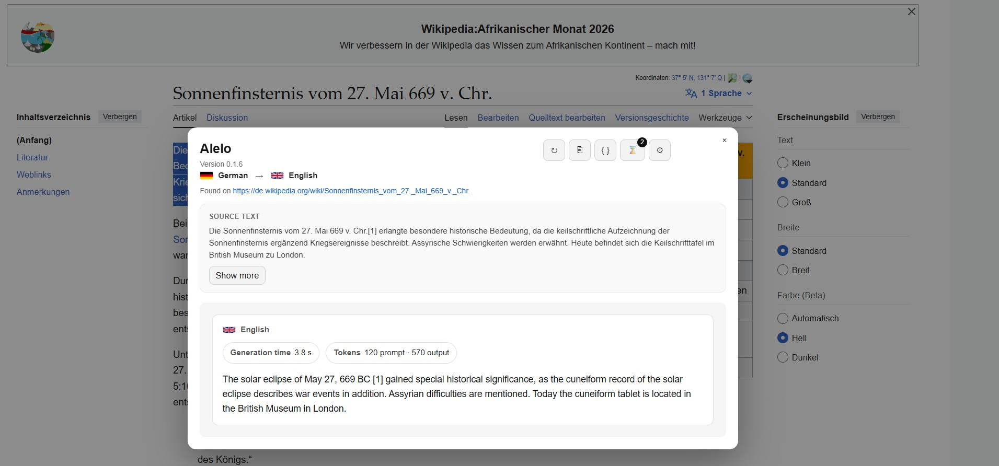
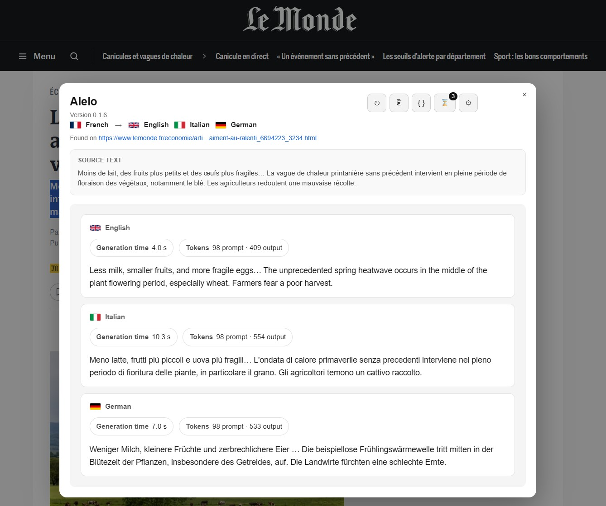
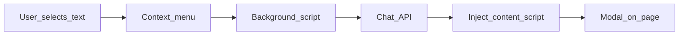

# Alelo

A Firefox extension (Manifest V3) that translates selected text using a local [Ollama](https://ollama.com/) chat API.

**Version:** 0.1.0

## Preview

Translation modal with detected source language, flags, and generation metadata:



Settings — configure Ollama, favorite languages, and the language picker:


Parallel translation to multiple favorite languages at once:



## Features

- **Selection context menu** — select text, right-click, and choose **Translate with Alelo** → pick a favorite language.
- **In-page modal** with:
  - **Translation** view — translated text with generation metadata
  - **Raw JSON** tab — full API response
  - **Retry** (↻) — re-translate the same text to the same language
  - **Copy** (⎘) — copy the translation
  - **History** (⌛) — browse and restore past translations (extension-wide, up to 30 entries)
  - **Settings** (⚙) — configure API URL, model, auth token, and **favorite languages**
- **Page source tracking** — history records where each translation was found (web page URL when available).
- **Friendly error messages** when the API is unreachable or the model is missing.
- **Persistent settings and history** via the extension `storage` API.

## How it works



1. You select text and pick a target language from the context menu submenu.
2. The background script sends the text to your configured Ollama `/api/chat` endpoint.
3. The content script shows a loading spinner, then the translation in a modal.
4. Successful translations are saved to history with the source text, target language, and page URL.

## Requirements

- **Ollama** (or any compatible chat API) running with a **text** model.

  Default model: **`gemma4:e2b`**

  ```bash
  ollama run gemma4:e2b
  ```

  See the [Ollama model library](https://ollama.com/library) for other text models.

- **CORS for extensions** — start Ollama with origins that allow the extension:

  Unix-like / macOS:

  ```bash
  OLLAMA_ORIGINS=moz-extension://* ollama serve
  ```

  Windows (Command Prompt):

  ```bat
  set OLLAMA_ORIGINS=moz-extension://*
  ollama serve
  ```

- Verify Ollama is running: [http://localhost:11434/api/tags](http://localhost:11434/api/tags)

## Install

**Temporary add-on (quick test):**

1. Clone this repository.
2. Open `about:debugging` → **This Firefox**.
3. Click **Load Temporary Add-on…** and select `manifest.json` in the repo root.

**Dev reload (recommended):**

```bash
yarn install
yarn firefox
```

`web-ext run` loads the extension and reloads it when files change. Temporary add-ons loaded manually disappear when Firefox restarts.

There is **no** build step — load the folder as-is.

**Publishing:** zip the extension folder and submit to [addons.mozilla.org](https://addons.mozilla.org). The add-on ID is set in `manifest.json` under `browser_specific_settings.gecko.id`.

## Usage

1. Open a web page with text content.
2. **Select the text** you want to translate.
3. **Right-click** and choose **Translate with Alelo** → pick a language.
4. Wait for the spinner. The translation appears in the modal with the source text and page source.
5. Use the header icon buttons:
   - **↻** — retry translation
   - **⎘** — copy translation
   - **▤** / **{ }** — switch between translation and raw JSON
   - **⌛** — open history; click an entry to restore it, or **×** to remove one
   - **⚙** — open settings
6. Close the modal with **×** or by clicking the backdrop.

### Favorite languages

Open **Settings** (⚙) in the modal to manage favorite languages:

- Add from the preset dropdown or enter a custom code and label
- Reorder with ↑ / ↓ (order matches the context menu submenu)
- Remove languages (at least one must remain)

After saving, the right-click submenu updates automatically.

### History

- Every successful translation is saved automatically (source text, translation, target language, page URL, raw JSON).
- History is stored in **local extension storage** — global across all websites and tabs.
- Up to **30** entries are kept (newest first).
- On translation failure, the history panel opens automatically if previous results exist.

## Configuration

Settings can be changed in the modal (**⚙**) without editing source code.

| Setting | Default | Description |
|---------|---------|-------------|
| **API URL** | `http://localhost:11434/api/chat` | Chat endpoint (Ollama or compatible) |
| **Model** | `gemma4:e2b` | Text model name sent in the request body |
| **Auth token** | *(empty)* | Optional bearer token |
| **Favorite languages** | English | Languages shown in the context menu submenu |

Defaults are defined in [`config.js`](config.js).

## Privacy and permissions

| Permission | Why |
|------------|-----|
| `contextMenus` | Add **Translate with Alelo** to the selection right-click menu |
| `scripting` / `activeTab` / `tabs` | Inject the modal content script into the active tab |
| `storage` | Save settings and translation history |
| `http://localhost:11434/*` | Default Ollama API |
| `http://*/*` / `https://*/*` | Reach non-localhost API hosts if configured |

Selected text is sent only to the chat endpoint you configure (by default, your local Ollama instance).

## Project layout

| Path | Role |
|------|------|
| `manifest.json` | MV3 manifest, permissions, web-accessible resources |
| `background.js` | Context menu, translation API call, orchestration |
| `config.js` | Default config, language presets, settings/history storage |
| `content.js` | Modal UI, translation display, history, settings |
| `content.html` / `content.css` | Modal markup and styles |
| `language-flags.js` | Language code → flag image URL mapping |
| `icons/` | Extension and toolbar icons |
| `docs/` | README preview screenshots |

## Troubleshooting

| Problem | What to try |
|---------|-------------|
| **Cannot reach the API** | Confirm Ollama is running and `OLLAMA_ORIGINS=moz-extension://*` is set |
| **Model not found (404)** | Check the model name in **Settings** matches an installed model (`ollama list`) |
| **No languages in menu** | Open Settings and save at least one favorite language |
| **Extension won't load** | Verify all icon PNGs exist under `icons/` |
| **Context menu missing after update** | Reload the extension on `about:debugging` → This Firefox |

## Credits

Language flag icons in the settings picker, favorites list, translation cards, and history are loaded from [flagcdn.com](https://flagcdn.com), provided by [Flagpedia.net](https://flagpedia.net).

## License

See [LICENSE](LICENSE).
